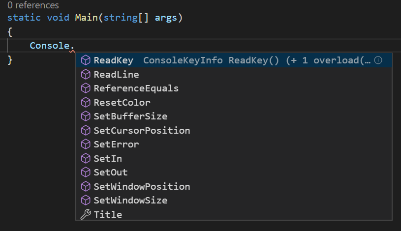
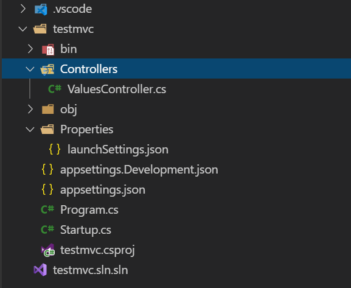
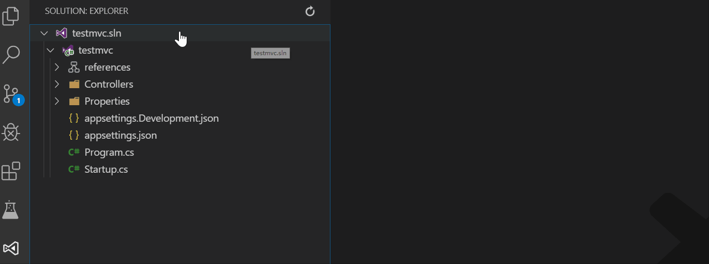
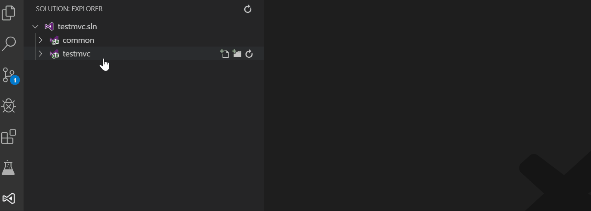
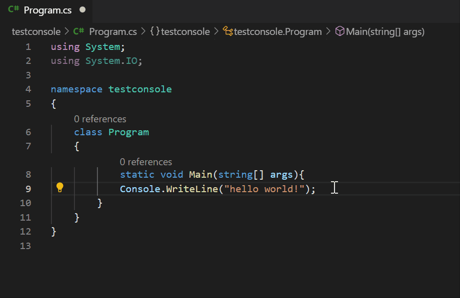
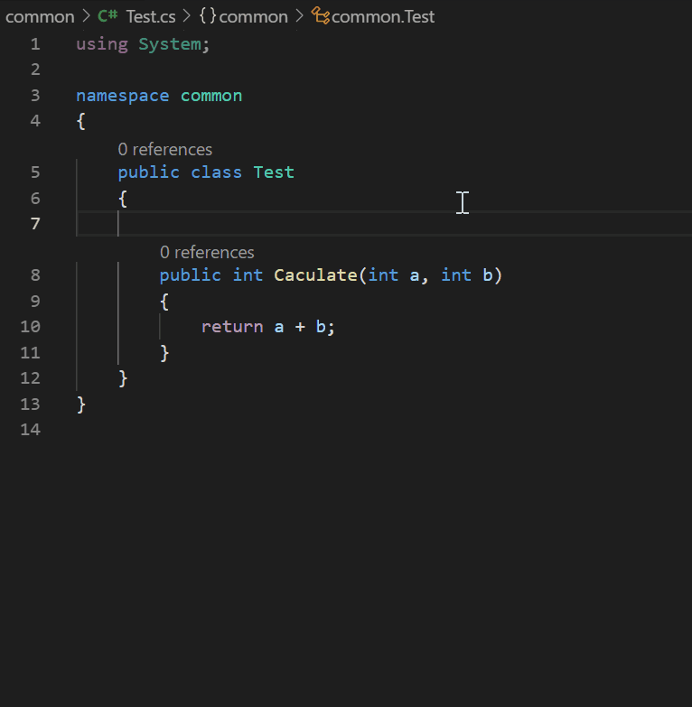
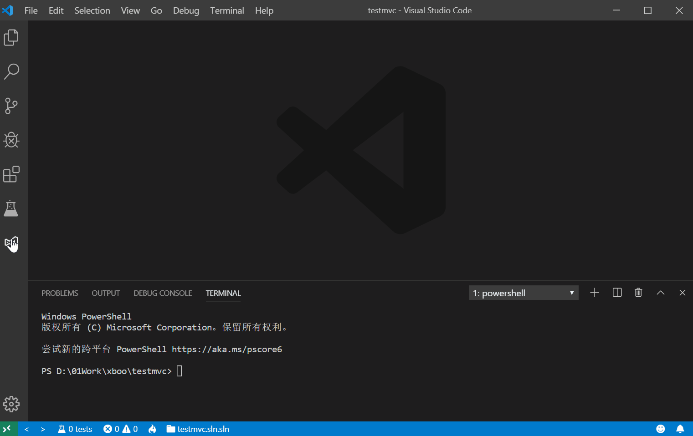
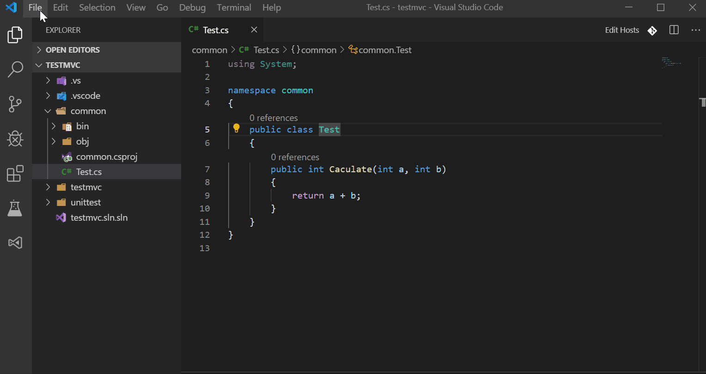

## 使用VS Code 开发.NET CORE 程序指南

#### 1. 前言
近两年来，很多前端的同学都开始将 VSCode 作为前端主力开发工具，其丰富的扩展给程序开发尤其是前端开发带来了很多便利，但是作为微软主力语言的 .NET，却由于有宇宙第一编辑器 Visual Studio存在，很少有看到有后端同学使用，笔者自己在 VSCode 刚出来时就折腾过将主力开发工具迁移至 VSCode，这样可以跨平台做开发（实际是当时想尝试在Mac上做开发），但当时由于插件还不完善，折腾过程也比较坑，遂放弃，继续拥抱宇宙第一编辑器。

近日有点时间，再次折腾VSCode，惊喜发现已经基本可以用VSCode完成大部分的开发工作，先将过程分享出来，给那些喜欢折腾的同学参考。

注意：本文只针对 .NET CORE 而非 .NET Framework 开发，同时需要对 VSCode 基本操作有一定的了解，如果你还在编写 .NET Framework 程序或者从来没有使用过VSCode，还需要先了解一些基础知识。
[官方文档]( https://code.visualstudio.com/docs)

#### 2. 插件安装说明
1. 必装插件：
    + [**C#**](https://marketplace.visualstudio.com/items?itemName=ms-VSCode.csharp) 
    + [**C# Extensions**](https://marketplace.visualstudio.com/items?itemName=jchannon.csharpextensions)

        有了以上插件，已经基本可以在VSCode中编写C#代码了，基本的智能感知，关键字高亮等功能都可以使用。

        
    
2.  进阶安装
    + [**VSCode-icons**](https://marketplace.visualstudio.com/items?itemName=VSCode-icons-team.VSCode-icons)
    
        VSCode-icon 可以给文件目录中的文件添加icon，便于我们分辨文件的类型

        
    
    + [**VSCode-solution-explorer**](https://marketplace.visualstudio.com/items?itemName=fernandoescolar.VSCode-solution-explorer)
    
        从Visual Studio迁移过来的同学比较大的一个问题就是，原来熟悉的解决方案不见了，纯粹的文件自我管理的方式用起来总是很别扭，安装了这个插件，VSCode 中将会增加一个菜单，原来熟悉的 Visual Studio 操作方式又回来了，具体看下图：

        

        有了此插件，我们在解决方案或者项目上右键，分别会弹出相应的快捷键菜单，满足我们日常开发中的一些常规操作：
        + 创建新项目
        + 添加/删除文件
        + 编译/打包
        + 移动项目至指定的文件夹
        + 其他

     例如将项目加入到指定文件夹下，便于管理：

     

    + [**Visual Studio Keymap**](https://marketplace.visualstudio.com/items?itemName=ms-VSCode.vs-keybindings)

        该插件可以将常用的 Visual Studio 快捷键映射到 VSCode 中，比如格式化代码快捷键 Ctrl+K+D
        
    
    + [**C# XML Documentation Comments**](https://marketplace.visualstudio.com/items?itemName=k--kato.docomment)

        该插件主要是可以方便的添加代码注释，例如在Visual Studio 中的 ///
        

    + [**NuGet Package Manager**](https://marketplace.visualstudio.com/items?itemName=jmrog.VSCode-nuget-package-manager)  
    + [**NuGet NuPkg Viewer**](https://marketplace.visualstudio.com/items?itemName=eridem.VSCode-nupkg)  

        目前添加nuget包，由于国内你懂的原因，导致在查询版本的时候会报错，无法正常安装，建议大家直接右键 csproj 项目文件添加相应的nuget包，关于这个问题，大家可以关注github上的 [Issue](https://github.com/jmrog/VSCode-nuget-package-manager/issues/38)

    + [**.NET Core Test Explorer**](https://marketplace.visualstudio.com/items?itemName=formulahendry.dotnet-test-explorer)

        **经过我的测试，.NET Core Test Explorer单元测试插件对于 MS Test 会出现无法发现的问题，建议大家采用xunit作为单元测试组件**
        
        
        **注意：单元测试必须在当前Workspace中进行配置Test Project Path**:即单元测试的项目名称，同时也可以在当前项目根目录中的.VSCode 添加 setting.json 文件，并添加如下配置项：
        ``` json
        {
            "dotnet-test-explorer.testProjectPath": "unittest"
        }
        ```

#### 3. 后记
有了上述插件的支持，我们基本上已经可以使用 VSCode 开发.NET CORE 应用程序了，不过由于目前安装Nuget包时会出现一些网络问题，笔者当前是采用 Visual Studio 添加各个组件包的引用，采用 VSCode 做开发,整个流程下来，还是可以胜任的。

由于笔者之前是Reshaper重度用户，喜欢 Alt+Enter 快捷键做一些快捷快捷操作，而VSCode中也会有一些快速提示操作，不过快捷键并不是Alt+Enter，需要自定义修改，修改方式如下(同理其他的快捷键也是在此改动)：
    

最后，VSCode 对于 Spring Boot 的支持也是相当友好的，笔者之前也使用 VSCode 开发过java程序，尤其是那些需要 NET 和JAVA 同时开发的同学，有兴趣也可以自己折腾下，这样就不用记两套快捷键了，而且 VSCode 的打开速度比 IDEA 快很多。