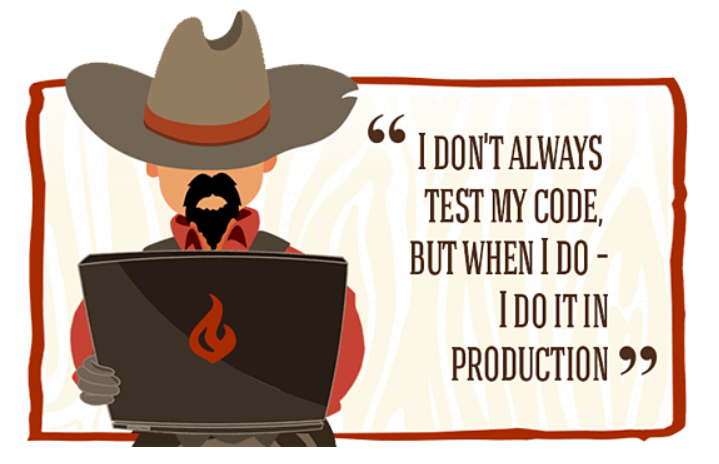

#### 背景
ASP.NET Core 支持依赖关系注入 (DI) 软件设计模式，并且默认注入了很多服务，具体可以参考 [官方文档](https://docs.microsoft.com/en-us/aspnet/core/fundamentals/dependency-injection?view=aspnetcore-3.0#framework-provided-services), 相信只要使用过依赖注入框架的同学，都会对此有不同深入的理解，在此无需赘言。

然而，在引入 IOC 框架之后，对于之前常规的对于类的依赖（new Class）变成通过构造函数对于接口的依赖（ASP.NET CORE 默认注入方式），这本身更加符合依赖倒置原则，但是对于单元测试来说确会带来另一个问题：由于层层依赖，导致在某个类的方法进行测试的时候，需要构造一大堆该类依赖的接口的实现，非常麻烦。

这个时候，我们脑子里会下意识想一个问题：**为什么常用的单元测试框架不支持依赖注入？**于是笔者在查阅了一些关于在单元测试中支持依赖注入的讨论[Github Issue](https://github.com/xunit/xunit/issues/687),以及其他的相关文档，突然明白一个问题：

<table><tr><td bgcolor=#EEEEEE style="font-weight:bold;color:#27408B"> 在对于一个方法的单元测试中，我们应该关注的是这个方法内部的逻辑测试，而这个方法内部对于外部的依赖，则不在这个单元测试关注的范围内</td></tr></table>

换言之，单元测试永远都只关注需要测试的方法内部的逻辑实现，至于外部依赖方法的测试，则应该放在另一个专门针对这个方法的单元测试用例中。弄清楚这个问题，我们才能更加理解另一个单元测试不可缺少的框架——**Mock框架**，在我们写的测试中，应该忽略外部依赖具体的实现，而是通过模拟该接口方法来显示的指定返回值，从而降低该返回值对于当前单元测试结果的影响，而 Mock 框架（例如最常用的Moq），刚好可以满足我们对于接口的模拟需求。

#### 如何对 ASP.NET CORE 中默认注入常用服务进行单元测试

本文以 [Xunit](https://github.com/xunit/xunit) 以及 [Moq 4.x](https://github.com/moq/moq4) 为例，展示在常用的 ASP.NET CORE 中会遇到的各种测试情况。

业务服务类如下：
```csharp
public class UserService : IUserService
{
    private ILogger _logger;

    public UserService(ILogger<UserService> logger)
    {
        this._logger = logger;
    }

    public void Login()
    {
        //do something
        this._logger.Log(LogLevel.Information, new EventId(), "Login", null, (m, e) => m);
    }

    public string GetUserInfo()
    {
        return $"hello world!";
    }
}
```

**1. IConfiguration 获取配置Mock**

``` csharp
var mockConfiguration = new Mock<IConfiguration>();
mockConfiguration.SetupGet(_ => _["RabbitMqOptions:HostName"]).Returns("127.0.0.1");
```

**2. Mock 更改方法返回参数**
```csharp
[Fact]
public void Test2()
{
    var mockInfo = "mock hello world";
    var mockUserService = new Mock<IUserService>();
    mockUserService.Setup(_ => _.GetUserInfo()).Returns(mockInfo);

    var userInfo= mockUserService.Object.GetUserInfo();
    Assert.Equal(mockInfo, userInfo);
}
```

**2. ILogger 日志组件 Mock**

通过 logger.Verify 验证日志至少输出一次：
``` csharp
[Fact]
public void LoginTest()
{
    var logger = new Mock<ILogger<UserService>>();
    var userService = new UserService(logger.Object);
    userService.Login();

    logger.Verify(_ => _.Log(It.IsAny<LogLevel>(),
                                It.IsAny<EventId>(),
                                It.IsAny<string>(),
                                It.IsAny<Exception>(), 
                                It.IsAny<Func<string, Exception, string>>()),
                    Times.Once);
}
```
**3. ServiceCollection 单元测试**
```csharp
public static void AddUserService(this IServiceCollection services, IConfiguration configuration)
{
    services.TryAddSingleton<IUserService, UserService>();
}
```

```csharp
 [Fact]
public void AddUserServiceTest() 
{
    var mockConfiguration = new Mock<IConfiguration>();

    var serviceConllection = new ServiceCollection();
    serviceConllection.AddUserService(mockConfiguration.Object);

    var provider = serviceConllection.BuildServiceProvider();
    var userService = provider.GetRequiredService<IUserService>();
    Assert.NotNull(userService);
}
```

**4. MiddleWare 单元测试**

示例 HealthMiddleware
```csharp
public class HealthMiddleware
{
    private readonly RequestDelegate _next;
    private readonly ILogger _logger;
    private readonly string _healthPath = "/health";

    public HealthMiddleware(RequestDelegate next, ILogger<HealthMiddleware> logger, IConfiguration configuration)
    {
        this._next = next;
        this._logger = logger;

        var healthPath = configuration["Consul:HealthPath"];
        if (!string.IsNullOrEmpty(healthPath))
        {
            this._healthPath = healthPath;
        }
    }

    public async Task Invoke(HttpContext httpContext)
    {
        if (httpContext.Request.Path == this._healthPath)
        {
            httpContext.Response.StatusCode = (int)HttpStatusCode.OK;
            await httpContext.Response.WriteAsync("I'm OK!");
        }
        else
            await _next(httpContext);
    }
}
```
单元测试：
```csharp
public class HealthMiddlewareTest
{
    private readonly Mock<ILogger<HealthMiddleware>> _mockLogger;
    private readonly Mock<IConfiguration> _mockConfiguration;
    private readonly string _healthPath = "/health";
    private readonly HttpContext _httpContext;
    private readonly Mock<RequestDelegate> _mockNext; //middleware next

    public HealthMiddlewareTest()
    {
        this._mockConfiguration = new Mock<IConfiguration>();
        this._mockConfiguration.SetupGet(c => c["Consul:HealthPath"]).Returns(_healthPath);

        this._mockLogger = new Mock<ILogger<HealthMiddleware>>();
        this._mockLogger.Setup(_ => _.Log<object>(It.IsAny<LogLevel>(), It.IsAny<EventId>(),
            It.IsAny<object>(), It.IsAny<Exception>(), It.IsAny<Func<object, Exception, string>>()))
            .Callback<LogLevel, EventId, object, Exception, Func<object, Exception, string>>(
            (logLevel, eventId, message, ex, fun) =>
            {
                Console.WriteLine($"{logLevel}\n{eventId}\n{message}\n{message}");
            });

        this._httpContext = new DefaultHttpContext();
        this._httpContext.Response.Body = new MemoryStream();
        this._httpContext.Request.Path = this._healthPath;

        this._mockNext = new Mock<RequestDelegate>();//next 委托 Mock
        this._mockNext.Setup(_ => _(It.IsAny<HttpContext>())).Returns(async () =>
        {
            await this._httpContext.Response.WriteAsync("Hello World!"); //模拟http请求最终输出
        });
    }

    [Fact]
    public async Task health_request_test()
    {
        var middleWare = new HealthMiddleware(this._mockNext.Object, this._mockLogger.Object,
            this._mockConfiguration.Object);

        await middleWare.Invoke(this._httpContext);//执行middleware

        this._httpContext.Response.Body.Seek(0, SeekOrigin.Begin); //获取监控检查请求获取到的response内容
        var reader = new StreamReader(this._httpContext.Response.Body);
        var returnStrs = await reader.ReadToEndAsync();

        Assert.Equal("I'm OK!", returnStrs);//断言健康检查api是否中间件拦截输出 "I'm OK!"
    }
}
```

#### 结语
几个问题：
1. CI/CD 流程中应该包含单元测试
例如在编写 Repository 层进行单元测试时，经常有同学会编写依赖于数据库数据的单元测试，这样并不利于随时随地的进行单元测试检查，如果将该流程放在CI/CD中，在代码的发布过程中通过单元测试可以检查代码逻辑的正确性，同时依赖于数据库的单元测试将不会通过（通常情况下，生产环境和开发环境隔离），变相迫使开发小伙伴通过 mock 方式模拟数据库返回结果。这个原则同样适用于不能依赖三方API编写单元测试。

2. 单元测试覆盖率
通常很多开发 Leader 都会要求开发团队编写单元测试，但是很少检查单元测试的质量，即单元测试最重要的指标——单元测试代码覆盖率，如果不注重覆盖率的提升，那么很有可能会导致开发成员为了单元测试而写单元测试，预期就会与实际情况相差甚远。保证单元测试代码覆盖率，将会大大降低代码变更带来的 Bug 率，从而节省整体开发成本。

3. 新人问题：为何要写单元测试？
对于初次开始编写单元测试的开发人员，脑中经常会对此表示怀疑：我为什么要去验证一堆我自己写的正确的逻辑？实际这个问题包含了区分一个一般开发人员和优秀开发人员很重要的一个条件：他是否会反向思考当前逻辑的正确性。有了这种思维，看待问题才会从多个角度入手分析，对问题的本质掌握更加全面。不要怀疑，坚持写单元测试，因为这也是对反向思维的一种锻炼，以笔者的经验，只有当编写过一段时间之后，才会真正认识单元测试的魅力，并且开始非常习惯的在写一段逻辑之后，顺手写了对于它的单元测试。
