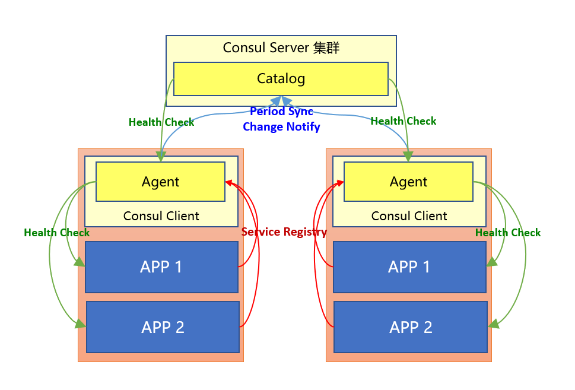
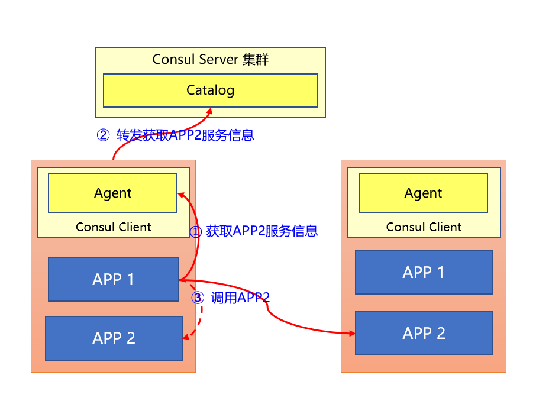

##ASP.NET CORE使用Consul实现服务治理与健康检查

####背景
笔者所在的公司正在进行微服务改造，这其中服务治理组件是必不可少的组件之一，在一番讨论之后，最终决定放弃 Zookeeper 而采用 Consul 作为服务治理框架基础组件。主要原因是 Consul 自带健康检查，通过该功能可以比较方便的监控应用的运行状态，从而更好的运维整个系统。但在实际实施过程中笔者发现，目前网络上所能看到的很多资料，没有比较清晰的解释 Consul 的运行方式，特别是当用户对于 Zookeeper 主动通知的方式比较熟悉之后，对于 Consul 这种每次都通过 HTTP 调用获取服务信息的方式还是存在很多疑惑的，比如：这样的方式在调用链中，不是会导致 HTTP 调用链增加一倍吗？

## Consul 概念简析
关于Consul，首先介绍最常见的一副图：

该图表示 Consul 支持的一个重要的功能———多数据中心，这也是很多服务注册发现工具所不具备的，通过上述图中我们可以解读出如下一些信息：
1. Cosnul 分为 Server 和 Client，多数据中心的实现主要依靠两个数据中心的 Server 进行通信，并且每个数据中心有各自的主节点，也就是各自选举。
2. Client 与 Server 之间通过8300端口，TCP协议进行RPC交互。
3. Client 与其他实例之间通过 8301 以 TCP/UDP 协议进行 LAN GOSSIP 交互

上图解释了 Consul 集群各个 Server 之间的关系，那么 Server 和 Client 之间的关系又是怎样呢？在理解这个问题之前，要先理解一个概念——反熵。

>关于反熵的概念，可以参考园子里 [波斯码](https://www.cnblogs.com/bossma/tag/Consul/) 所写的文章——[Consul的反熵](https://www.cnblogs.com/bossma/p/11354245.html)，此文对于反熵的解释非常到位。感兴趣的同学可以进一步研究。

如果用一句话来概括那大概就是：分而治之，Server 将服务的管辖权（健康检查，服务注册等功能）层层下放给 Client，而 Client 在需要时（例如健康检查失败，新的服务注册等）将所管辖范围内的服务信息进行转发或上报。

这个特点也决定了 Consul 服务的注册和健康检查方式：所有操作都是通过 Consul Client 中的 Agent 来实现的。如下图所示：


根据上图所示有个重要的概念：
> 1. 如果我们通过 Consul Client 中的 Agent 获取服务时，则只能返回当前这个 Consul Client 中所注册的所有服务
> 2. 而如果我们通过 Consul Server 中的 Catalog 获取服务时，则可以获取到所有注册到 Client 的服务。

事实上即使我们需要获取 Catalog 中的信息时，也不是直接与 Consul Server 交互，而是通过当前服务器 Consul Client 转发请求获取。同时取决于反熵概念，如果我们把每台服务器看作管理辖区的最小单位，那么则需要在每台机器上部署 Consul Client，用它来管理这台服器上所有的服务。

如果按照上述信息实施部署，那么我们来看下假如 APP1 调用 APP2 时，具体的调用顺序时怎样的：

如上图所示，这样的部署其实会带来一些问题：
>1. 每台机器上都需要部署 Consul Client
>2. 服务请求链路成倍增加了

*问题1：* 部署成本增加，实际上是一次性工作，况且假如你是容器化部署的话，那这个问题基本可以忽略。

*问题2：* 调用链路增加的确会带来很多问题，主要是在调用 APP2 之前增加了 ① ② 两步，其中步骤 ① 为本机 HTTP 调用，步骤 ② 为 Consul集群内部的 RPC 调用，经过笔者实际测试这个调用耗时在毫秒级，除非对于性能要求很高的情况下，普通的调用链路请求是可以容忍的，而笔者所在公司的方案目前也是基于此方案。如果不能容忍，那只能牺牲部分一致性，在本地进行缓存，并设定合理的同步周期。

>*思考一下：笔者认为上述问题是 Consul 反熵机制所带来的缺陷，只有通过主动请求 Consul Server 才能获取所有服务的信息，而又缺少比较好的通知机制，导致应用程序无法缓存服务信息。而相比较于 Zookeeper，由于有了通知机制，使各个应用程序可以缓存服务列表信息，只有当收到通知时，才主动更新服务信息。同时 zookeeper 是长连接，当服务在出现问题时可以更加及时获取到变化，而Consul 必须要依赖健康检查，而健康检查是有周期性的。当然凡事都各有利弊，但我们要知晓个中优缺点，才能更加合理使用。*

相信有了这些概念的理解，我们可以在初次接触 Consul 时减少一些疑惑。那么我们解下来看下，如何在编码中使用 Consul。

## Consul 在 ASP.NET CORE 中的使用

Consul服务在注册时需要注意几个问题：
1. 那就是必须是在服务完全启动之后再进行注册，否则可能导致服务在启动过程中已经注册到 Consul Server，这时候我们要利用 IApplicationLifetime 应用程序生命周期管理中的 ApplicationStarted 事件。
2. 应用程序向 Consul 注册时，应该在本地记录应用 ID，以此解决每次重启之后，都会向 Consul 注册一个新实例的问题，便于管理。

具体代码如下：
>*注意：以下均为根据排版要求所展示的示意代码，并非完整的代码*

#### 1. 服务治理之服务注册
+ 1.1 服务注册扩展方法

```csharp
public static IApplicationBuilder AgentServiceRegister(this IApplicationBuilder app,
    IApplicationLifetime lifetime,
    IConfiguration configuration,
    IConsulClient consulClient,
    ILogger logger)
{
    try
    {
        var urlsConfig = configuration["server.urls"];
        ArgumentCheck.NotNullOrWhiteSpace(urlsConfig, "未找到配置文件中关于 server.urls 相关配置！");

        var urls = urlsConfig.Split(';');
        var port =  urls.First().Substring(httpUrl.LastIndexOf(":") + 1);
        var ip = GetPrimaryIPAddress(logger);
        var registrationId = GetRegistrationId(logger);

        var serviceName = configuration["Apollo:AppId"];
        ArgumentCheck.NotNullOrWhiteSpace(serviceName, "未找到配置文件中 Apollo:AppId 对应的配置项！");

        lifetime.ApplicationStarted.Register(() =>
        {
            var healthCheck = new AgentServiceCheck
            {
                DeregisterCriticalServiceAfter = TimeSpan.FromSeconds(5),
                Interval = 5,
                HTTP = $"http://{ip}:{port}/health",
                Timeout = TimeSpan.FromSeconds(5),
                TLSSkipVerify = true
            };

            var registration = new AgentServiceRegistration
            {
                Checks = new[] { healthCheck },
                ID = registrationId,
                Name = serviceName.ToLower(),
                Address = ip,
                Port = int.Parse(port),
                Tags = ""
            };

            consulClient.Agent.ServiceRegister(registration).Wait();
            logger.LogInformation($"服务注册成功! 注册地址：{((ConsulClient)consulClient).Config.Address}, 注册信息：{registration.ToJson()}");
        });

        lifetime.ApplicationStopping.Register(() =>
        {
            consulClient.Agent.ServiceDeregister(registrationId).Wait();
        });

        return app;
    }
    catch (Exception ex)
    {
        logger?.LogSpider(LogLevel.Error, "服务发现注册失败！", ex);
        throw ex;
    }
}

private static string GetPrimaryIPAddress(ILogger logger)
{
    string output = GetLocalIPAddress();
    logger?.LogInformation(LogLevel.Information, "获取本地网卡地址结果：{0}", output);

    if (output.Length > 0)
    {
        var ips = output.Split(new[] { ',' }, StringSplitOptions.RemoveEmptyEntries);
        if (ips.Length == 1) return ips[0];
        else
        {
            var localIPs = ips.Where(w => w.StartsWith("10"));//内网网段
            if (localIPs.Count() > 0) return localIPs.First();
            else return ips[0];
        }
    }
    else
    {
        logger?.LogSpider(LogLevel.Error, "没有获取到有效的IP地址，无法注册服务到服务中心！");
        throw new Exception("获取本机IP地址出错，无法注册服务到注册中心！");
    }
}

public static string GetLocalIPAddress()
{
    if (!string.IsNullOrWhiteSpace(_localIPAddress)) return _localIPAddress;

    string output = "";
    try
    {
        foreach (NetworkInterface item in NetworkInterface.GetAllNetworkInterfaces())
        {
            if (item.OperationalStatus != OperationalStatus.Up) continue;

            var adapterProperties = item.GetIPProperties();
            if (adapterProperties.GatewayAddresses.Count == 0) continue;

            foreach (UnicastIPAddressInformation address in adapterProperties.UnicastAddresses)
            {
                if (address.Address.AddressFamily != AddressFamily.InterNetwork) continue;
                if (IPAddress.IsLoopback(address.Address)) continue;

                output = output += address.Address.ToString() + ",";
            }
        }
    }
    catch (Exception e)
    {
        Console.WriteLine("获取本机IP地址失败！");
        throw e;
    }

    if (output.Length > 0)
        _localIPAddress = output.TrimEnd(',');
    else
        _localIPAddress = "Unknown";

    return _localIPAddress;
}

private static string GetRegistrationId(ILogger logger)
{
    try
    {
        var basePath = Directory.GetCurrentDirectory();
        var folderPath = Path.Combine(basePath, "registrationid");
        if (!Directory.Exists(folderPath))
            Directory.CreateDirectory(folderPath);

        var path = Path.Combine(basePath, "registrationid", ".id");
        if (File.Exists(path))
        {
            var lines = File.ReadAllLines(path, Encoding.UTF8);
            if (lines.Count() > 0 && !string.IsNullOrEmpty(lines[0]))
                return lines[0];
        }

        var id = Guid.NewGuid().ToString();
        File.AppendAllLines(path, new[] { id });
        return id;
    }
    catch (Exception e)
    {
        logger?.LogWarning(e, "获取 Registration Id 错误");
        return Guid.NewGuid().ToString();
    }
}
```
+ 1.2 健康检查中间件

既然健康检查是通过http请求来实现的，那么我们可以通过 HealthMiddleware 中间件来实现：

```csharp
public static void UseHealth(this IApplicationBuilder app)
{
    app.UseMiddleware<HealthMiddleware>();
}

public class HealthMiddleware
{
    private readonly RequestDelegate _next;
    private readonly string _healthPath = "/health";

    public HealthMiddleware(RequestDelegate next, IConfiguration configuration)
    {
        this._next = next;
        var healthPath = configuration["Consul:HealthPath"];
        if (!string.IsNullOrEmpty(healthPath))
        {
            this._healthPath = healthPath;
        }
    }

    public async Task Invoke(HttpContext httpContext)
    {
        if (httpContext.Request.Path == this._healthPath)
        {
            httpContext.Response.StatusCode = (int)HttpStatusCode.OK;
            await httpContext.Response.WriteAsync("I'm OK!");
        }
        else
            await this._next(httpContext);
    }
}
```
+ 1.3 Startup 配置

```csharp
public void ConfigureServices(IServiceCollection services)
{
    services.AddMvc().SetCompatibilityVersion(CompatibilityVersion.Version_2_2);
    services.AddSingleton<IConsulClient>(sp =>
    {
        ArgumentCheck.NotNullOrWhiteSpace(this.Configuration["Consul:Address"], "未找到配置中Consul:Address对应的配置");
        return new ConsulClient(c => { c.Address = new Uri(this.Configuration["Consul:Address"]); });
    });
}
public void Configure(IApplicationBuilder app, IHostingEnvironment env, IApplicationLifetime lifetime, IConsulClient consulClient, ILogger<Startup> logger)
{
    ...
    app.UseHealth();
    app.UseMvc();
    app.AgentServiceRegister(lifetime, this.Configuration, consulClient, logger);
}
```
#### 2. 服务治理之服务发现

``` csharp
public class ServiceManager : IServiceManager
{
    private readonly IHttpClientFactory _httpClientFactory;
    private readonly ILogger _logger;
    private readonly IConsulClient _consulClient;
    private readonly IList<Func<StrategyDelegate, StrategyDelegate>> _components;
    private StrategyDelegate _strategy;

    public ServiceManager(IHttpClientFactory httpClientFactory,
        IConsulClient consulClient,
        ILogger<ServiceManager> logger)
    {
        this._cancellationTokenSource = new CancellationTokenSource();
        this._components = new List<Func<StrategyDelegate, StrategyDelegate>>();

        this._httpClientFactory = httpClientFactory;
        this._optionsConsulConfig = optionsConsulConfig;
        this._logger = logger;
        this._consulClient = consulClient;
    }

    public async Task<HttpClient> GetHttpClientAsync(string serviceName, string errorIPAddress = null, string hashkey = null)
    {
        var resonse = (await this._consulClient.Health.Service(serviceName.ToLower(), this._cancellationTokenSource.Token)).Response;
        var filteredService = this.GetServiceNode(serviceName, resonse.ToArray(), hashkey);
        return this.CreateHttpClient(serviceName.ToLower(), filteredService.Service.Address, filteredService.Service.Port);
    }

    private ServiceEntry GetServiceNode(string serviceName, ServiceEntry[] services, string hashKey = null)
    {
        if (this._strategy == null)
        {
            lock (this) { if (this._strategy == null) this._strategy = this.Build(); }
        }

        var filterService = this._strategy(serviceName, services, hashKey);
        return filterService.FirstOrDefault();
    }

    private HttpClient CreateHttpClient(string serviceName, string address, int port)
    {
        var httpClient = this._httpClientFactory.CreateClient(serviceName);
        httpClient.BaseAddress = new System.Uri($"http://{address}:{port}");
        return httpClient;
    }
}
```
#### 服务治理之——访问策略

服务在注册时，可以通过配置或其他手段给当前服务配置相应的 Tags ，同样在服务获取时，我们也将同时获取到该服务的 Tags, 这对于我们实现策略访问夯实了基础。例如开发和测试共用一套服务注册发现基础设施（当然这实际不可能），我们就可以通过给每个服务设置环境 Tag ，以此来实现环境隔离的访问。这个 tag 维度是没有限制的，开发人员完全可以根据自己的实际需求进行打标签，这样既可以通过内置默认策略兜底，也允许开发人员在此基础之上动态的定制访问策略。

笔者所实现的访问策略方式类似于 Asp.Net Core Middleware 的方式，并参考了部分源码实现。具体如下：
``` csharp
public delegate ServiceEntry[] StrategyDelegate(string serviceName, ServiceEntry[] services, string hashKey = null);
public class ServiceManager:IServiceManager
{
    private readonly IList<Func<StrategyDelegate, StrategyDelegate>> _components;
    private StrategyDelegate _strategy;

    public ServiceManager()
    {
        this._components = new List<Func<StrategyDelegate, StrategyDelegate>>();
    }

    public IServiceManager UseStrategy(Func<StrategyDelegate, StrategyDelegate> strategy)
    {
        _components.Add(strategy);
        return this;
    }

    private StrategyDelegate Build()
    {
        StrategyDelegate strategy = (sn, services, key) =>
        {
            return new DefaultStrategy().Invoke(null, sn, services, key);
        };

        foreach (var component in _components.Reverse())
        {
            strategy = component(strategy);
        }

        return strategy;
    }
}
public class DefaultStrategy : IStrategy
{
    private ushort _idx;
    public DefaultStrategy(){}

    public ServiceEntry[] Invoke(StrategyDelegate next, string serviceName, ServiceEntry[] services, string hashKey = null)
    {
        var service = services.Length == 1 ? services[0] : services[this._idx++ % services.Length];
        var result = new[] { service };
        return next != null ? next(serviceName, result, hashKey) : result;
    }
}
```
自定义策略扩展方法以及使用
``` csharp
public static IApplicationBuilder UseStrategy(this IApplicationBuilder app)
{
    var serviceManager = app.ApplicationServices.GetRequiredService<IServiceManager>();
    var strategies = app.ApplicationServices.GetServices<IStrategy>();
    foreach (var strategy in strategies)
    {
        serviceManager.UseStrategy(next =>
        {
            return (serviceName, services, hashKey) => strategy.Invoke(next, serviceName, services, hashKey);
        });
    }
    return app;
}

public class Startup
{
    public void ConfigureServices(IServiceCollection services)
    {
        ...
        services.AddSingleton<IStrategy, CustomStrategy>(); //自定义策略1
        services.AddSingleton<IStrategy, CustomStrategy2>(); //自定义测率2
    }

    public void Configure(IApplicationBuilder app, IHostingEnvironment env, IApplicationLifetime lifetime, IConsulClient consulClient, ILogger<Startup> logger)
    {
        app.UseStrategy(); //手动高亮
        app.AgentServiceRegister(lifetime, this.Configuration, consulClient, logger);
    }
}
```
